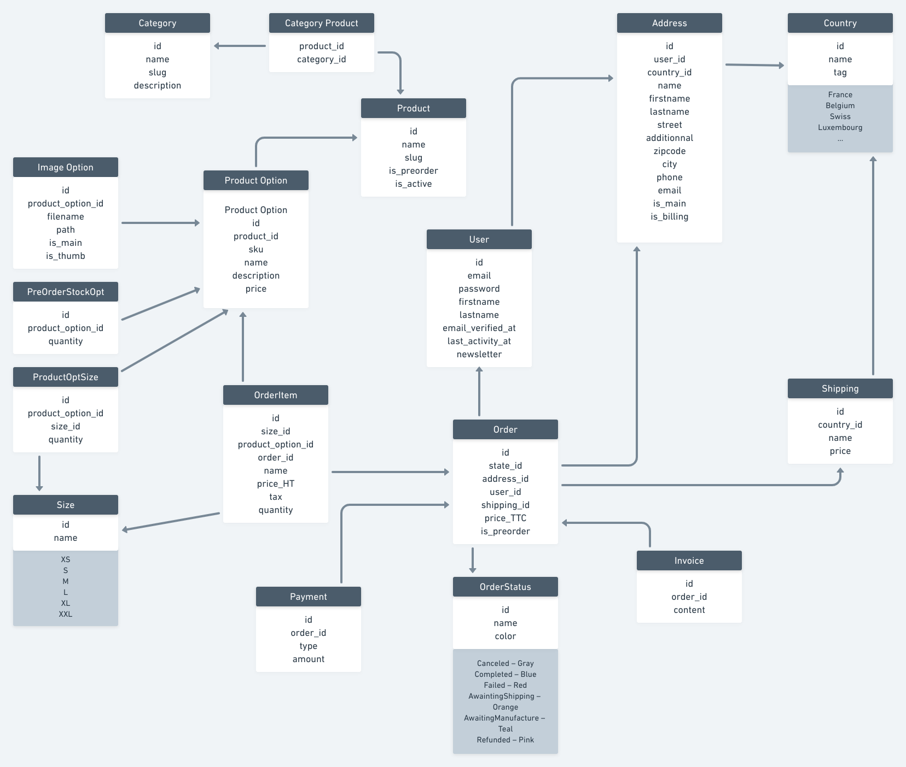

# BEEHEMIAM

Site e-commerce destiné à la marque de vêtements pour mère allaitante **Beehemiam**.   

## Sommaire
1. [Informations générales](#informations-generales)
2. [Schéma de la base de données](#schema-de-la-base-de-donnees)

---

### TODO

- [x] Importer Larawind (admin template)
- [ ] Créer le template front
- [ ] Panier (update; delete; Vuejs)

### Informations générales

Site internet accessible à cette adresse : [beehemiam.fr](https://beehemiam.fr)  
Technologies utilitisées : 
* Laravel v8+
* MySQL

/!\ Token dans bootstap.js et dans URL API

### Schéma de la base de données

- [x] User (HASMANY: addresses, orders)
- [x] Country (HASMANY: addresses, shippings)
- [x] Shipping (HASMANY: orders; BELONGSTO: country)
- [x] Address (HASMANY: orders; BELONGSTO: country, user)
- [x] Category (BELONGSTOMANY: products)
- [x] Product (BELONGSTOMANY: products; HASMANY: productOptions)
- [x] CategoryProduct (--)
- [x] ProductOption (HASMANY: imageOptions, productOptionSizes, orderItems; BELONGSTO: product; HASONE: preOrderProductOptionQuantity, discount)
- [x] ImageOption (BELONGSTO: productOption)
- [x] PreOrderProductOptionQuantity (BELONGSTO: productOption)
- [x] Size (HASMANY: productOptionSizes)
- [x] ProductOptionSize (BELONGSTO: productOption, size)
- [x] OrderStatus (HASMANY: orders)
- [x] Order (BELONGSTO: orderStatus, address, user, shipping; HASMANY: orderItems, coupons; HASONE: payment, invoice)
- [x] OrderItem (BELONGSTO: size, productOption, order)
- [x] Payment (BELONGSTO: order)
- [x] Invoice (BELONGSTO: order)
- [x] Discount (BELONGSTO: productOption)
- [x] Coupon (BELONGSTO: order)
